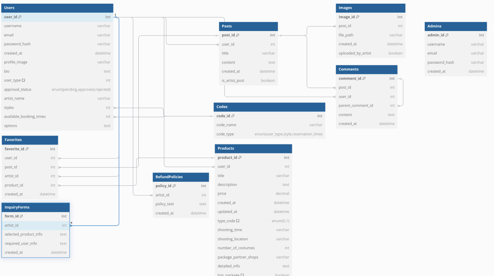
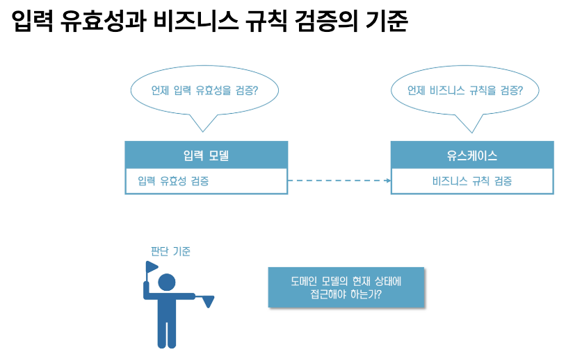

[](https://sonarcloud.io/summary/new_code?id=Onboarding-serivce_BE-onboarding)
# 디어모먼트 백엔드 업무분장표

## 🗂️ 업무 분장표

| **담당자** | **주요 업무**                                | **상세 내용**                                                                                       |
|------------|---------------------------------------------|----------------------------------------------------------------------------------------------------|
| **성민**   | 🖼️ 이미지 관련 기능 및 게시글 작성/관리          | - 유저가 업로드한 이미지 처리 및 저장<br>- 이미지 최적화 및 썸네일 생성<br>- 게시글 작성 및 관리 기능 개발<br>- 댓글 및 대댓글 기능 구현 |
| **병욱**   | 🧑‍💻 회원가입 및 사용자/작가 관리                 | - 유저 회원가입 및 로그인<br>- 사용자 정보 수정<br>- OAuth 기반 인증 기능 구현<br>- 작가 및 유저 프로필 관리 |
| **호준**   | 🛠️ 백오피스, 상품 관리, 찜 기능, 코드 관리 개발 | - 백오피스 기능 개발 (관리자용 대시보드)<br>- 작가별 상품 등록, 수정, 삭제 관리<br>- 찜 기능 구현 및 성민과 협업<br>- 코드 관리 (유저 유형 코드 포함) |
| **공통**   | 🌐 API 개발 및 문서화                           | - RESTful API 개발 및 유지보수<br>- API 문서화 및 외부 연동 지원<br>- 공통 응답 형식 표준화        |

---

## 📋 업무 분장 세부 설명

### 1. 성민 (이미지 및 게시글 관련)
- **이미지 관련**: 게시글 작성 시 업로드되는 이미지 처리 및 저장 담당.
- **게시글 관련**: 게시글 작성 및 수정/삭제와 관련된 전체적인 기능 구현.
- **댓글 및 대댓글 기능**: 댓글 작성, 수정, 삭제, 대댓글 구현.

### 2. 병욱 (회원가입 및 사용자/작가 관리)
- 회원 가입, 로그인, 사용자 정보 수정 등 사용자 인증 및 관리 담당.
- OAuth 기반 로그인과 인증 구현.
- 작가 및 유저 프로필 관리, 작가 승인 처리.
- 유저 유형 (일반 유저, 스냅 작가, 웨딩 작가 등) 코드 기반 관리.

### 3. 호준 (백오피스, 상품 관리, 찜 기능, 코드 관리 개발)
- **백오피스**: 관리자 대시보드 및 시스템 관리 기능 개발.
- **상품 관리**: 작가별 상품 등록, 수정, 삭제 기능 구현.
    - **추가 작가 정보 관리**:
        - **작가명**: 텍스트 입력.
        - **촬영 스타일, 예약 가능 시기**: 코드 관리에서 먼저 등록 후 작가 등록 시 선택.
        - **제공 이미지**: 이미지 업로드 기능 구현.
        - **문의 양식**:
- **찜 기능**: 사용자의 찜 기능 구현 및 관리, 작가 및 상품 연계.
    - **찜 연계 항목**: 게시글, 작가, 상품.
- **코드 관리**: 유저 유형 코드, 스타일 코드, 예약 가능 시기 코드 관리 기능 개발.
    - **작가 코드 관리**:
        - **스타일 코드 관리 및 등록**:
            - 키워드명
            - 키워드 코드
        - **예약 시기 코드 관리 및 등록**:
            - 키워드명
            - 키워드 코드

### 4. 공통 (API 개발 및 문서화)
- RESTful API 설계 및 구현.
- Swagger 또는 Postman을 활용한 API 문서화.
- 공통 에러 응답 및 상태 코드 관리.

---

## 🔗 예상 API 엔드포인트 갯수

### 1. 이미지 관련 기능 (성민)
- **POST /api/images**: 이미지 업로드
- **GET /api/images/{id}**: 이미지 조회
- **DELETE /api/images/{id}**: 이미지 삭제

**예상 API 개수**: 3개

### 2. 회원가입 및 사용자/작가 관리 (병욱)
- **POST /api/users/signup**: 회원가입
- **POST /api/users/login**: 로그인
- **GET /api/users/{id}**: 사용자 정보 조회
- **PATCH /api/users/{id}**: 사용자 정보 수정
- **POST /api/users/logout**: 로그아웃
- **PATCH /api/users/{id}/approve-artist**: 유저를 작가로 승인
- **GET /api/users/artists**: 작가 목록 조회
- **GET /api/users/{id}/profile**: 유저/작가 프로필 조회

**예상 API 개수**: 8개

### 3. 게시글 작성 및 관리 (성민)
- **POST /api/posts**: 게시글 작성
- **GET /api/posts**: 게시글 목록 조회
- **GET /api/posts/{id}**: 게시글 상세 조회
- **PATCH /api/posts/{id}**: 게시글 수정
- **DELETE /api/posts/{id}**: 게시글 삭제

**예상 API 개수**: 5개

### 4. 댓글 및 대댓글 기능 (성민)
- **POST /api/comments**: 댓글 작성
- **GET /api/comments/{postId}**: 댓글 조회
- **PATCH /api/comments/{id}**: 댓글 수정
- **DELETE /api/comments/{id}**: 댓글 삭제
- **POST /api/comments/{id}/replies**: 대댓글 작성
- **GET /api/comments/{id}/replies**: 대댓글 조회

**예상 API 개수**: 6개

### 5. 찜 기능 (호준)
- **POST /api/favorites**: 찜하기 추가 (게시글, 작가, 상품)
- **GET /api/favorites**: 찜한 목록 조회
- **DELETE /api/favorites/{id}**: 찜하기 삭제

**예상 API 개수**: 3개

### 6. 상품 관리 기능 (호준)
- **POST /api/products**: 상품 등록
- **GET /api/products**: 상품 목록 조회
- **GET /api/products/{id}**: 상품 상세 조회
- **PATCH /api/products/{id}**: 상품 수정
- **DELETE /api/products/{id}**: 상품 삭제

**예상 API 개수**: 5개

### 7. 코드 관리 기능 (호준)
- **POST /api/codes**: 코드 등록
- **GET /api/codes**: 코드 목록 조회
- **GET /api/codes/{id}**: 코드 상세 조회
- **PATCH /api/codes/{id}**: 코드 수정
- **DELETE /api/codes/{id}**: 코드 삭제

**예상 API 개수**: 5개

### 8. 백오피스 기능 (호준)
- **GET /api/admin/users**: 사용자 목록 조회
- **PATCH /api/admin/users/{id}**: 사용자 권한 변경 (관리자 승격 및 작가 승인)
- **GET /api/admin/stats**: 통계 데이터 조회
- **PATCH /api/admin/settings**: 시스템 설정 변경

**예상 API 개수**: 4개

---

### **총 예상 API 개수**: 39개

---

## 📂 데이터베이스 상세 설명



### 1. Users 테이블
- **user_id** (PK): 사용자의 고유 ID.
- **username**: 사용자의 이름.
- **email**: 사용자의 이메일 주소.
- **password_hash**: 사용자의 암호화된 비밀번호.
- **created_at**: 계정 생성 일자.
- **profile_image**: 유저/작가 프로필 이미지 경로.
- **bio**: 유저/작가 소개.
- **user_type**: 유저 유형 (0: 일반 유저, 1: 스냅 작가, 2: 웨딩 작가).
- **approval_status**: 작가 승인 상태 (`pending`, `approved`, `rejected`).
- **artist_name**: 작가명 (텍스트).
- **styles**: 촬영 스타일 (FK, Codes 테이블 참조).
- **available_booking_times**: 예약 가능 시기 (FK, Codes 테이블 참조).
- **options**: 옵션, 안내사항 및 환불 규정 (텍스트).

### 2. Posts 테이블
- **post_id** (PK): 게시글의 고유 ID.
- **user_id** (FK): 게시글을 작성한 사용자 ID.
- **title**: 게시글 제목.
- **content**: 게시글 내용.
- **created_at**: 게시글 작성 일자.
- **is_artist_post**: 작가가 작성한 게시글 여부 (Boolean).

### 3. Images 테이블
- **image_id** (PK): 이미지의 고유 ID.
- **post_id** (FK): 이미지를 포함한 게시글 ID.
- **file_path**: 이미지 파일 경로.
- **created_at**: 이미지 업로드 일자.
- **uploaded_by_artist**: 제공 이미지 여부 (Boolean).

### 4. Comments 테이블
- **comment_id** (PK): 댓글의 고유 ID.
- **post_id** (FK): 댓글이 달린 게시글 ID.
- **user_id** (FK): 댓글을 작성한 사용자 ID.
- **parent_comment_id** (FK): 상위 댓글 ID (대댓글 구현).
- **content**: 댓글 내용.
- **created_at**: 댓글 작성 일자.

### 5. Favorites 테이블
- **favorite_id** (PK): 찜하기의 고유 ID.
- **user_id** (FK): 찜한 사용자 ID.
- **post_id** (FK): 찜한 게시글 ID.
- **artist_id** (FK): 찜한 작가 ID.
- **product_id** (FK): 찜한 상품 ID.
- **created_at**: 찜한 일자.

### 6. Products 테이블
- **product_id** (PK): 상품의 고유 ID.
- **user_id** (FK): 상품을 등록한 작가 ID.
- **title**: 상품 제목.
- **description**: 상품 설명.
- **price**: 상품 가격.
- **created_at**: 상품 등록 일자.
- **updated_at**: 상품 수정 일자.
- **type_code**: 상품 종류 코드 (0: 단품, 1: 패키지).
- **shooting_time**: 촬영 시간.
- **shooting_location**: 촬영 장소.
- **number_of_costumes**: 의상 수.
- **package_partner_shops**: 패키지 제휴샵 (패키지인 경우).
- **detailed_info**: 상세 정보.
- **has_package**: 패키지 유무 (computed based on type_code).

### 7. Codes 테이블
- **code_id** (PK): 코드의 고유 ID.
- **code_name**: 코드 이름.
- **code_type**: 코드 유형 (유저 유형, 스타일, 예약 시기).

### 8. Admins 테이블
- **admin_id** (PK): 관리자 계정 고유 ID.
- **username**: 관리자 이름.
- **email**: 관리자 이메일.
- **password_hash**: 관리자 암호화된 비밀번호.
- **created_at**: 관리자 계정 생성 일자.

### 9. InquiryForms 테이블
- **form_id** (PK): 문의 양식의 고유 ID.
- **artist_id** (FK): 문의 양식을 소유한 작가 ID.
- **selected_product_info**: 유저가 선택한 상품 정보.
- **required_user_info**: 양식에 필요한 유저 입력 정보 (참조 필드).
- **created_at**: 문의 양식 생성 일자.

### 10. RefundPolicies 테이블
- **policy_id** (PK): 환불 규정의 고유 ID.
- **artist_id** (FK): 환불 규정을 소유한 작가 ID.
- **policy_text**: 환불 규정 내용.
- **created_at**: 환불 규정 생성 일자.

---

## 헥사고날 아키텍처 예시
```
src/main/java/com/example/yourproject
├── application
│   ├── port
│   │   ├── in
│   │   │   ├── UseCaseInterface1.java  # Core로 들어오는 요청을 정의하는 포트
│   │   │   ├── UseCaseInterface2.java
│   │   └── out
│   │       ├── ExternalServicePort.java  # Core가 외부와 상호작용하기 위한 포트
│   │       ├── PersistencePort.java
│   ├── service
│       ├── UseCaseService1.java  # 도메인 로직을 구현하는 서비스
│       ├── UseCaseService2.java
├── domain
│   ├── model
│   │   ├── Entity1.java   # 도메인 엔티티
│   │   ├── Entity2.java
│   ├── exception
│       ├── BusinessException.java  # 비즈니스 로직 예외
│       ├── ValidationException.java
├── adapter
│   ├── in
│   │   ├── web
│   │   │   ├── Controller1.java  # HTTP 요청 처리
│   │   │   ├── Controller2.java
│   │   ├── messaging
│   │       ├── MessageListener1.java  # 메시지 큐 리스너
│   │       ├── MessageListener2.java
│   └── out
│       ├── persistence
│       │   ├── RepositoryImpl1.java  # DB와 상호작용
│       │   ├── RepositoryImpl2.java
│       ├── external
│           ├── ExternalServiceAdapter1.java  # 외부 API 호출
│           ├── ExternalServiceAdapter2.java

```

### 주요 클래스 및 역할
- application.port.in
    - 애플리케이션의 유스케이스를 정의하는 인터페이스입니다.
    - 예: CreateOrderUseCase, GetOrderDetailsUseCase 등. 
  
- application.port.out
  - 도메인 로직이 외부 시스템과 상호작용해야 할 때 사용하는 인터페이스입니다.
  - 예: OrderRepository, PaymentGatewayPort 등.

- application.service
  - 포트(인터페이스)를 구현하는 서비스 클래스입니다.
  - 비즈니스 로직을 처리하며, 도메인 객체와 상호작용합니다.

- domain
  - 핵심 도메인 로직과 엔티티를 포함합니다.
  - 모든 비즈니스 규칙은 이 계층에 정의됩니다.
  - 예: Order, Customer, OrderStatus 등.

- adapter.in
  - 사용자 인터페이스 계층입니다.
  - REST API, 메시지 큐 리스너 등 외부에서 애플리케이션으로 들어오는 요청을 처리합니다.

- adapter.out
  - 외부 시스템과의 상호작용을 담당합니다.
  - 예: 데이터베이스, 외부 API, 파일 시스템 등과의 연동.

### 유효성 검증
- 입력 데이터 검증 (adapter.in):
  - HTTP 요청 또는 메시지 큐로부터 들어오는 데이터를 검증합니다.
  - 예: @RequestBody 객체의 필드 유효성 검사.
  - 기술: javax.validation 또는 Spring Validation.

- 도메인 로직 검증 (domain):
  - 도메인 규칙을 위반하는 데이터는 생성되지 않도록 합니다.
  - 예: 엔티티 생성 시, 값이 유효하지 않으면 ValidationException 발생.
  - 기술: 생성자 또는 정적 팩토리 메서드.

- 외부 의존성 검증 (adapter.out):
  - 외부 시스템으로부터 받은 데이터를 검증합니다.
  - 예: 외부 API의 응답 데이터 유효성 확인.

- 이외 참고 자료 (만들면서 배우는 클린 아키텍처 책 발췌)
  
  

### 의존성 방향
- 의존성은 항상 Core 방향으로 흘러가야 합니다.
- 어댑터 → 포트 → Core의 방향을 유지하여 Core가 어댑터나 외부 시스템에 의존하지 않도록 해야 합니다.

## 참고자료
- [주니어 개발자의 백엔드 아키텍처 개선 도전기](https://techblog.uplus.co.kr/%EC%A3%BC%EB%8B%88%EC%96%B4-%EA%B0%9C%EB%B0%9C%EC%9E%90%EC%9D%98-%EB%B0%B1%EC%97%94%EB%93%9C-%EC%95%84%ED%82%A4%ED%85%8D%EC%B2%98-%EA%B0%9C%EC%84%A0-%EB%8F%84%EC%A0%84%EA%B8%B0-9fb19982db9c)
- [만들면서 배우는 클린 아키텍처 책 예제 소스 깃](https://github.com/wikibook/clean-architecture)
- [hexagonal architecture?](https://medium.com/@hello-every-one/hexagonal-architecture-3729e9a9200b)
